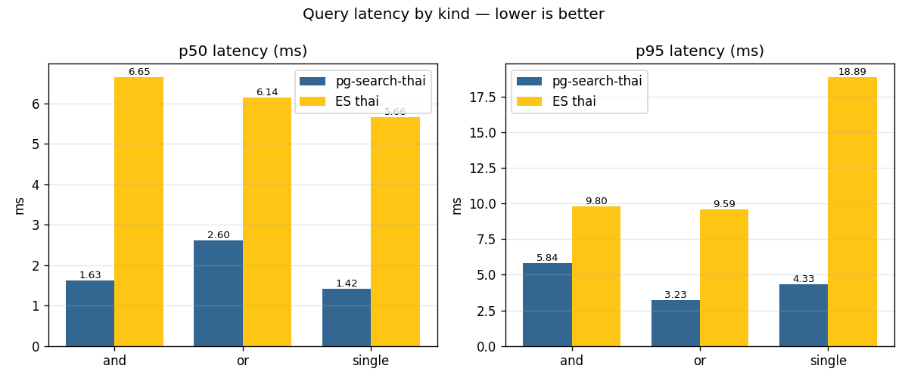

pg-search-thai
============================

pg-search-thai is full text search _PostgreSQL_ extension for Thai Language.

Its main purpose is:

To enable PostgreSQL Full Text Search in Thai language (Due to Thai Language does not use spaces to separate words)

## Performance

Benchmarked against **Elasticsearch 8.15 with the built-in `thai` analyzer** on
100,000 Thai Wikipedia articles, single Docker host, warm cache:



| Metric | pg-search-thai | ES (thai analyzer) |
|---|---|---|
| Single-term query (p50 / p95) | **1.4 ms / 4.3 ms** | 5.7 ms / 18.9 ms |
| Boolean AND (p50 / p95) | **1.6 ms / 5.8 ms** | 6.7 ms / 9.8 ms |
| Boolean OR (p50 / p95) | **2.6 ms / 3.2 ms** | 6.1 ms / 9.6 ms |
| Index size | **105 MB** | 427 MB |
| Write → searchable lag | 0 ms (transactional) | ~1 s (refresh interval) |

Full reproducible harness, methodology, and caveats: see [`bench/BENCHMARKS.md`](bench/BENCHMARKS.md)
and [`bench/README.md`](bench/README.md).

## Installation

### Quick start with Docker

Spins up Postgres 18 with `thai_parser` pre-built and the extension auto-created:

    git clone https://github.com/zdk/pg-search-thai.git
    cd pg-search-thai
    docker compose up -d

Connect with `psql` (password: `testpass`):

    psql -h localhost -U testuser -d testdb \
      -c "SELECT * FROM ts_parse('thai_parser', 'ต้มยำกุ้ง');"

### From source

Install `libthai` and the Postgres build headers via your package manager:

    # Debian / Ubuntu
    sudo apt install -y build-essential libthai-dev postgresql-server-dev-all

    # macOS (Homebrew)
    brew install libthai libdatrie

Then build and install the extension:

    git clone https://github.com/zdk/pg-search-thai.git
    cd pg-search-thai
    make
    sudo make install

To install only the parser (without the bundled hunspell dictionary files):

    cd thai_parser && make && sudo make install

## Usage

- Start the **psql** console ( Or any postgresql client, **pgAdmin** for instance ) and create the extension you have just installed by typing the following command:

    ```CREATE EXTENSION thai_parser;```

  This will create the parser and a default text search configuration named `thaicfg`.

- Note: This extension is only tested with `UTF-8` encoding. So, it is highly recommended to initial database with utf-8.

## Example 1
Check how parser works.

    SELECT * FROM ts_parse('thai_parser', 'ต้มยำกุ้งน้ำข้น ( Thai sour and spicy shrimp soup ) และไข่เจียวร้อนๆ');

## Example 2
Try to build document from `thaicfg` configuration that uses the specified parser.

    SELECT to_tsvector('thaicfg', 'ต้มยำกุ้งน้ำข้น ( Thai sour and spicy shrimp soup ) และไข่เจียวร้อนๆ');

## Example 3
Querying

    SELECT to_tsvector('thaicfg', 'the land of somtum (ส้มตำ)') @@ to_tsquery('thaicfg','ส้มตำ');
     ?column?
    ----------
     t
    (1 row)

## Example 4
Querying with `|` and `&` operator.

    SELECT to_tsvector('thaicfg', 'ส้มตำไก่ย่าง ต้มยำกุ้ง in thailand') @@ to_tsquery('thaicfg','ข้าวเหนียว&ส้มตำ');
     ?column?
    ----------
     f
    (1 row)

    SELECT to_tsvector('thaicfg', 'ข้าวเหนียวส้มตำไก่ย่าง ต้มยำกุ้ง in thailand') @@ to_tsquery('thaicfg','ข้าวเหนียว&ส้มตำ');
     ?column?
    ----------
     t
    (1 row)

## Example 5
 If you want to use hunspell as a dictionary for the full text search.
 Make sure you have already install thai hunspell dictionay files in `pg_config --sharedir`/tsearch_data directory.

    CREATE TEXT SEARCH DICTIONARY thai_hunspell (
        TEMPLATE = ispell,
        DictFile = th_TH,
        AffFile = th_TH,
        StopWords = english
    );


In psql console type `\dFd` to see if dictionary is installed.
Then,

    ALTER TEXT SEARCH CONFIGURATION thaicfg ADD MAPPING FOR a WITH simple, thai_hunspell;

And, test with,

    SELECT ts_lexize('thai_hunspell', 'ทดสอบ');

## Bugs Report and Contributing

GitHub issue tracker and pull requests are welcome.

_pg-search-thai_ is released under the GNU General Public License (GPLv2).
Refer to License [FAQ](http://www.gnu.org/licenses/old-licenses/gpl-2.0-faq.html) for more information.
